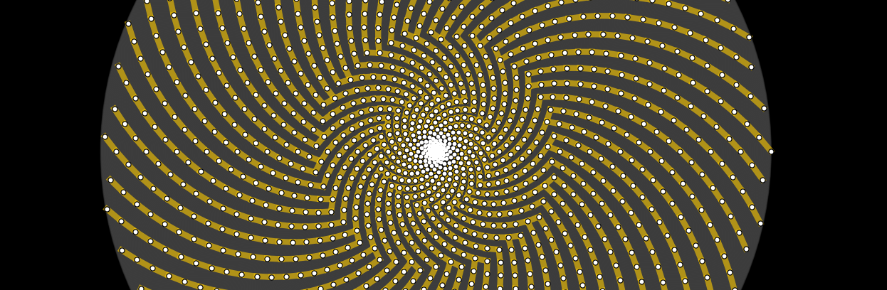

exploring the architecture of all that is
-----------------------------------------

.. image:: ./_static/root3-harmonics-banner.png
   :align: center

**GEOMETOR** is an open-source initiative dedicated to the exploration of
fundamental aspects of geometry, nature, and logic.

A key mission has been the development of a Python software library to create
symbolic models of classical geometric constructions

abstraction and reasoning
-------------------------

.. image:: ./_static/arc-banner.png
   :align: center

While the emphasis of the **GEOMETOR** project, has been geometry 

- arcprize_: code and reference materials
- arcprizesessions_:

geometric modeling
------------------

.. At the heart is the `GEOMETOR explorer`_ - a Python library for building and
.. analyzing geometric constructions with sympbolic algebra.

All of the research and development for **GEOMETOR** is located here in a
collection of repositories. There are many, but these establish the foundation for the work:

- model_: tools for modeling geometric constructions
- render_: tools for rendering geometric constructions
- divine_: model and analyze the golden ratio
- elements_: extract and codify knowledge from the classic work
.. - explorer_: explore and interact with geometric models

patterns in nature
------------------

- phyllotaxis

  model and investigate geometry of plants

other interesting projects
--------------------------

- pappus

  model and investigate pappus theorem

Each repository has:

- Python source code
- demo code
- source for project website
- discussion group
- log
- todo list
- MIT license

The website for each project is statically-generated and hosted through GitHub.

contribute
----------
We welcome contributions from anyone interested in geometry, mathematics,
nature, or programming. Feel free to contribute to our repositories, raise
issues, or propose enhancements.

Check out general info on **GEOMETOR**:

- geometor.com_
-

**GEOMETOR** is an organization led by `phi ARCHITECT`_

.. _`phi ARCHITECT`: https://github.com/phiarchitect
.. _model: https://github.com/geometor/model
.. _render: https://github.com/geometor/render
.. _elements: https://github.com/geometor/elements
.. _divine: https://github.com/geometor/divine

.. _arcprize: https://github.com/geometor/arcprize
.. _arcprizesessions: https://github.com/geometor/arcprizesessions

.. _phyllotaxis: https://github.com/geometor/phyllotaxis

.. _geometor.com: https://geometor.com

